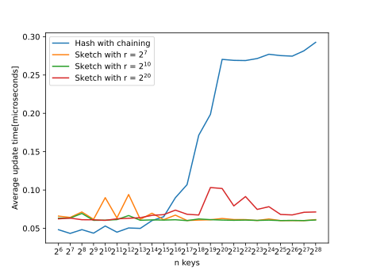
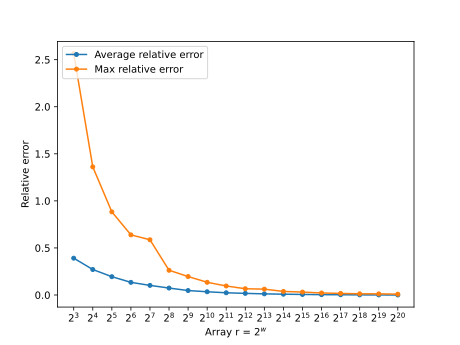
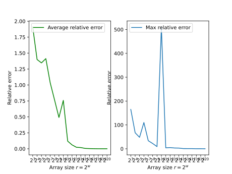

*You can find the code of this project on https://github.com/TTTTao725/Randomized-Algorithm-project2
***
## Exercise 1
$$\begin{aligned}
\mathbb{E}[X] &= \Vert f \Vert _{2}^{2} + \mathbb{E}[\sum_{(j,k) \in [n]\times [n]: j \neq k} 1_{[h(j) = h(k)]} g(j) g(k) f_j f_k] \\
&\Downarrow (1)\\
&= \Vert f \Vert _{2}^{2} + \sum_{(j,k) \in [n]\times [n]: j \neq k} \mathbb{E}[1_{[h(j) = h(k)]} g(j) g(k) f_j f_k] \\
&\Downarrow (2)\\
&= \Vert f \Vert _{2}^{2} + \sum_{(j,k) \in [n]\times [n]: j \neq k} \mathbb{E}[1_{[h(j) = h(k)]}] \mathbb{E}[g(j) g(k)] f_j f_k \\
&\Downarrow (3)\\
&= \Vert f \Vert _{2}^{2} + \sum_{(j,k) \in [n]\times [n]: j \neq k} \mathbb{E}[1_{[h(j) = h(k)]}] \mathbb{E}[g(j)] \mathbb{E}[g(k)] f_j f_k \\
&\Downarrow (4)\\
&= \Vert f \Vert _{2}^{2}
\end{aligned}$$
\*The derivation (1) uses the **linearity of expectation**.*
\**The derivation (2) uses the independence of $h$ and $g$.*
\**The derivation (3) uses the independence of the hash values of distinct keys.*
\**The derivation (4) is because $\mathbb{E}[g(j)]=0$.*
***
## Exercise 2
$$\begin{aligned}
Var(X) &= Var(\Vert f \Vert _{2}^{2} + \sum_{(j,k) \in [n]\times [n]: j \neq k} 1_{[h(j) = h(k)]} g(j) g(k) f_j f_k]) \\
&= Var(\sum_{(j,k) \in [n]\times [n]: j \neq k} 1_{[h(j) = h(k)]} g(j) g(k) f_j f_k]) \\
&= \mathbb{E}[(\sum_{(j,k) \in [n]\times [n]: j \neq k} 1_{[h(j) = h(k)]} g(j) g(k) f_j f_k])^2] -\\ &\ \ \ \ \ \mathbb{E}^2[\sum_{(j,k) \in [n]\times [n]: j \neq k} 1_{[h(j) = h(k)]} g(j) g(k) f_j f_k]] \\
&= \mathbb{E}[(\sum_{(j,k) \in [n]\times [n]: j \neq k} 1_{[h(j) = h(k)]} g(j) g(k) f_j f_k])^2]\\
&= \mathbb{E}[\sum_{\substack{(j,k) \in [n]\times [n]: j \neq k\\ (p,q) \in [n]\times [n]: p \neq q}}1_{[h(j) = h(k)]} 1_{[h(p) = h(q)]} g(j) g(k) g(p) g(q)f_j f_k f_p f_q] \\
&= \sum_{\substack{(j,k) \in [n]\times [n]: j \neq k\\ (p,q) \in [n]\times [n]: p \neq q}} \mathbb{E}[1_{[h(j) = h(k)]} 1_{[h(p) = h(q)]} g(j) g(k) g(p) g(q)f_j f_k f_p f_q] \\
&\overset{(1)}{=} \sum_{\substack{(j,k) \in [n]\times [n]: j \neq k\\ (p,q) \in [n]\times [n]: p \neq q \\p=j, q=k}} \mathbb{E}[1_{[h(j) = h(k)]} 1_{[h(p) = h(q)]} g(j) g(k) g(p) g(q)f_j f_k f_p f_q] +\\ &\ \ \ \ \ 
\sum_{\substack{(j,k) \in [n]\times [n]: j \neq k\\ (p,q) \in [n]\times [n]: p \neq q \\p=k, q=j}} \mathbb{E}[1_{[h(j) = h(k)]} 1_{[h(p) = h(q)]} g(j) g(k) g(p) g(q)f_j f_k f_p f_q] +\\ &\ \ \ \ \ 
\sum_{\substack{(j,k) \in [n]\times [n]: j \neq k\\ (p,q) \in [n]\times [n]: p \neq q \\p,q\notin \{j,k\}}} \mathbb{E}[1_{[h(j) = h(k)]} 1_{[h(p) = h(q)]} g(j) g(k) g(p) g(q)f_j f_k f_p f_q] \\
&\overset{(2)}{=} 2\sum_{(j,k) \in [n]\times [n]: j \neq k} \mathbb{E}[1^2_{[h(j) = h(k)]}] \mathbb{E}[g^2(j)] \mathbb{E}[g^2(k)] f_j^2 f_k^2\\
&\overset{(3)}{=} 2\sum_{(j,k) \in [n]\times [n]: j \neq k} \mathbb{E}[1_{[h(j) = h(k)]}] f_j^2 f_k^2\\
&= 2\sum_{(j,k) \in [n]\times [n]: j \neq k} Pr[h(j) = h(k)] f_j^2 f_k^2\\
&= \frac{2}{r}\sum_{(j,k) \in [n]\times [n]: j \neq k}f_j^2 f_k^2\\
&\leq \frac{2}{r} (\sum_{j \in [n]\times [n]}f_j^2)^2 \\
&= \frac{2(\Vert f \Vert _{2}^{2})^2}{r}
\end{aligned}$$
The key derivations are equal signs (1), (2) and (3).
\* *For (1), we partition the summation into 3 different parts: $p=j$ & $q=k$, $p=k$ & $q=j$ and $p,q \notin \{i,j\}$. The last part can be written as $\sum_{\substack{(j,k) \in [n]\times [n]: j \neq k\\ (p,q) \in [n]\times [n]: p \neq q \\p,q\notin \{j,k\}}} \mathbb{E}[1_{[h(j) = h(k)]}1_{[h(p) = h(q)]}] \mathbb{E}[g(j)] \mathbb{E}[g(k)] \mathbb{E}[g(p)] \mathbb{E}[g(q)]f_j f_k f_p f_q$ because $h$ and $g$ are independent and $g$ is 4-wise independent. Again this term is obviously 0 due to $\mathbb{E}[g(j)] = 0$.*
\* *For (2), the first 2 parts above are actually the same, so they can be merged.*
\* *For (3), this holds because $\mathbb{E}[g^2(j)] = 1$.*
***
## Exercise 3
According to the Chebyshev’s Inequality, we have $Pr[|X - \mathbb{E}[X]| > k] < \frac{Var(X)}{k^2}$. Based on the derivations above, the inequality becomes
$$
Pr[|X - \Vert f \Vert _{2}^{2}| > \varepsilon \Vert f \Vert _{2}^{2}] < \frac{Var(X)}{\varepsilon^2 (\Vert f \Vert _{2}^{2})^2} \leq \frac{2(\Vert f \Vert _{2}^{2})^2}{r\varepsilon^2(\Vert f \Vert _{2}^{2})^2} = \frac{2}{r\varepsilon^2} < \frac{1}{4}
$$
We want to bound the probability to be a quarter at most, then
$$
r > \frac{8}{\varepsilon^2}
$$
***
## Exercise 4 & 5
We implemented modified Hashing with chaining data structure to store the exact vector norm and the sketching data structure to estimate it. 
In hashing with chaining, we set the hash function to be $h: [2^w] \to [2^{w-1}]$, i.e we are mapping the universe space to a half of it. This can be done by the mutiply-shift hash function.
On the other hand, the hash functions in the sketching $h : [n] \to [r]$ and $g : [n] \to \{-1, 1\}$ are implemented by another hash function $k : [n] \to [p]$.
Finally, we test these hash functions $10^6$ times with keys $i = 0,...,10^6 - 1$. The average time for evaluating these hash functions are the following (The time unit is microsecond):
|  mutiply-shift   | mersenne modulo h  | mersenne modulo g| regular modulo h| regular modulo g|
|  ----  | ----  | ---- | ----| ----|
| 0.050983  | 0.04044 | 0.033073 | 0.020796 | 0.02111 |
***
## Exercise 6 & 7
For this part of experiment, we've tried to make $10^9$ updates in each of 23 experiments, but unfortunately the running time was way too slow when $the\ size\ of\ the\ universe > 2^{11}$, so we changed it to make $10^6$ updates instead.
Again, we set the hash function to be $h: [2^w] \to [2^{w-1}]$ in the hashing with chaining data structure. The average update time of Hashing with chaining and sketching is shown below:

As the result shows, the average update time of sketching of 3 different array size $r = 2^7, 2^{10}, 2^{20}$ are more stable than that of hashing with chaining as shown above. As expected, the average update time for sketching data structure is almost constant, so should the hashing with chaining. But the plot for hashing with chaining is much more unstable. 
When $logn = 12$, the average update time of hashing with chaining raise up to $0.6$, almost the 6 times compared to the previous experiments, I guess that's why the running time is extremely slow when $logn > 11$. It took us a whole night to run the 5th experiment ($logn = 12$) and we still could not finish it.
Maybe the reason why this 
***
## Exercise 8 & 9
In this part, we will check the precision of estimation of the vector norm by sketching. We plotted the average error and the max error over $1000$ times.

Now we will check the effect of hash functions in the sketching data structure respect to the estimation of the vector norm. Compared with the 4-wise independent hash functions $h$ and $g$, we implemented two 2-wise independent hash functions and repeated the previous experiments. The result of the 2-wise hash functions are:

Clearly, the choice of hash functions does matter. So we do need 4-wise independence to ensure the precision of estimation of sketching due to the derivations in the exercises.